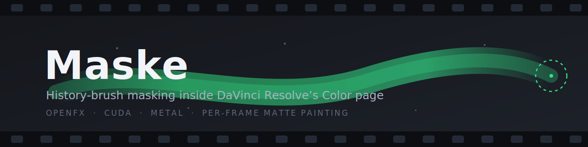
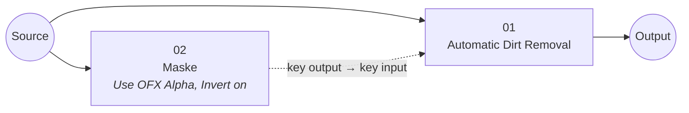

<p align="center">
  
</p>

<p align="center">
  
  
  
  
</p>

**Maske** (Turkish for *mask*) is an OpenFX plugin that brings **history-brush style matte painting into DaVinci Resolve's Color page**. You paint directly in the viewer, frame by frame, and the painted matte comes out of the node's alpha — ready to gate any other node's key input.

## Why this exists

Resolve's **Automatic Dirt Removal** (ResolveFX Revival) is excellent on archival footage — until something moves fast. Motion that exceeds its estimation produces smearing and patch artifacts, and the Color page offers no way to *paint* those regions back to the original image. The usual workaround is a round trip to the Fusion page for a history-brush composite: functional, but slow, and it pulls you out of the grading workflow entirely.

Maske removes the round trip. It was built for film restoration work — masking dirt-removal artifacts on fast-moving subjects — but it is a general-purpose viewer-painted matte: anything you can do with a key, you can now do with a brush stroke, without leaving the Color page.

## How it works

Maske lives on its own node **outside the serial image path**: the source feeds it in parallel, its image output stays disconnected, and only its key matters. Your brush strokes become the **alpha channel**, and with Resolve's **Use OFX Alpha** enabled that alpha becomes the node's key output — which you route into the node whose effect you want to suppress:



Painted areas kill the dirt-removal key, so the original image shows through exactly where you brushed — the history-brush behavior, natively in the Color page.

### Setup in 30 seconds

1. Add a new node and connect the **Source directly to its RGB input**, leaving its RGB output unconnected — it sits parallel to your chain.
2. Drop Maske on it (OpenFX → *Mustafa Ekinci → Maske*).
3. Right-click the node → **Use OFX Alpha**, and turn on **Invert** in the plugin controls.
4. Drag the node's key output (blue square) to the dirt-removal node's key input (blue triangle).
5. Paint in the viewer. Done.

### Adjusting the brush

You can change size and softness without leaving the viewer:

| Key | Action |
|---|---|
| `↑` / `↓` | Brush size up / down |
| `→` / `←` | Softness softer / harder |

Arrow keys are used on purpose — their codes are identical on every keyboard layout (Turkish, US, …) and need no AltGr/Shift.

The cursor is a **Photoshop-style translucent highlight** (red for paint, blue for erase), drawn as a filled disc so it stays solid at any zoom level. Softness reads as a **denser hard core inside a fainter halo**, and a small readout prints the exact `px` and `soft %`. The Brush Size / Softness sliders in the panel still work and stay in sync.

## Features

| | |
|---|---|
| 🖌️ **Viewer painting** | Photoshop-style translucent brush highlight in the Color page viewer (OverlayInteractV2 + DrawSuite) — red for paint, blue for erase, solid at any zoom |
| ⌨️ **In-viewer brush control** | Arrow keys (layout-independent) for size/softness, with a live highlight and `px`/`soft %` readout at the cursor — no trip to the panel |
| 🎞️ **Per-frame strokes** | Strokes belong to the frame you paint them on; step through and correct frame by frame |
| ↩️ **Undo & persistence** | One stroke = one undo step; strokes are saved inside the project |
| 🔀 **Invert** | Output the matte directly in the polarity your key routing needs |
| 🩻 **Show Matte** | Debug view of the raw matte |
| 🧹 **Clear frame / clear all** | One-click stroke removal |
| ⚡ **GPU rendering** | CUDA on Windows (Turing and newer), Metal on macOS, with a multithreaded CPU fallback — no GPU→CPU readback in the node tree |

## Requirements

- **DaVinci Resolve Studio** (the free edition does not load third-party OpenFX)
- Windows 10/11 x64 or macOS
- Optional GPU acceleration: NVIDIA RTX 20-series or newer (Windows), any Metal GPU (macOS)

## Installation

Copy the built `HistoryBrush.ofx.bundle` into the standard OFX directory and restart Resolve:

| Platform | Path |
|---|---|
| Windows | `C:\Program Files\Common Files\OFX\Plugins\` |
| macOS | `/Library/OFX/Plugins/` |

## Building from source

The OpenFX SDK headers are the only dependency ([AcademySoftwareFoundation/openfx](https://github.com/AcademySoftwareFoundation/openfx)); pass their location as `OFX_INCLUDE_DIR`.

### Windows (VS 2022 Build Tools + CMake + Ninja, CUDA Toolkit optional)

```bat
call "C:\Program Files (x86)\Microsoft Visual Studio\2022\BuildTools\VC\Auxiliary\Build\vcvars64.bat"
cmake -S . -B build -G Ninja -DCMAKE_BUILD_TYPE=Release ^
      -DOFX_INCLUDE_DIR=C:/path/to/openfx/include ^
      -DCMAKE_CUDA_COMPILER="C:/Program Files/NVIDIA GPU Computing Toolkit/CUDA/v13.3/bin/nvcc.exe"
cmake --build build
build\CudaSmokeTest.exe   :: verifies the CUDA kernel without launching Resolve
```

If no CUDA compiler is found, the build silently falls back to CPU-only.

### macOS (Xcode command line tools + CMake)

```sh
cmake -S . -B build -DCMAKE_BUILD_TYPE=Release \
      -DOFX_INCLUDE_DIR=/path/to/openfx/include \
      -DCMAKE_OSX_ARCHITECTURES="arm64;x86_64"
cmake --build build
sudo cp -R build/HistoryBrush.ofx.bundle /Library/OFX/Plugins/
```

## Architecture

```
src/HistoryBrush.cpp      plugin core: OFX actions, params, viewer interact, CPU render
src/GpuBackend.h          shared GPU interface (stamps precomputed to pixel space)
src/HistoryBrushCuda.cu   CUDA kernel + launcher (Windows/Linux, Turing+)
src/HistoryBrushMetal.mm  Metal kernel, runtime-compiled MSL (macOS)
test/CudaSmokeTest.cpp    standalone CUDA verification, no Resolve needed
```

Brush stamps are stored per frame in a serialized (hidden) string parameter, so they travel with the project file and participate in undo. During a stroke only a lightweight counter parameter changes; the full stroke data is committed once on pen-up, keeping painting responsive no matter how much has been painted.

## Status & known limitations

- ✅ Windows + CUDA path: in production use, kernel verified by the standalone smoke test
- ⚠️ **macOS Metal path: written but not yet tested on real hardware** — reports and fixes welcome
- The matte is brush-stamp based (circles with softness); there is no shape/spline mode
- Strokes do not auto-track motion — this tool is deliberately for fast manual frame-by-frame fixes

## Author

**Mustafa Ekinci** — [@must.ekinci on Instagram](https://www.instagram.com/must.ekinci)

## License

[MIT](LICENSE) — do whatever you like; attribution appreciated.
